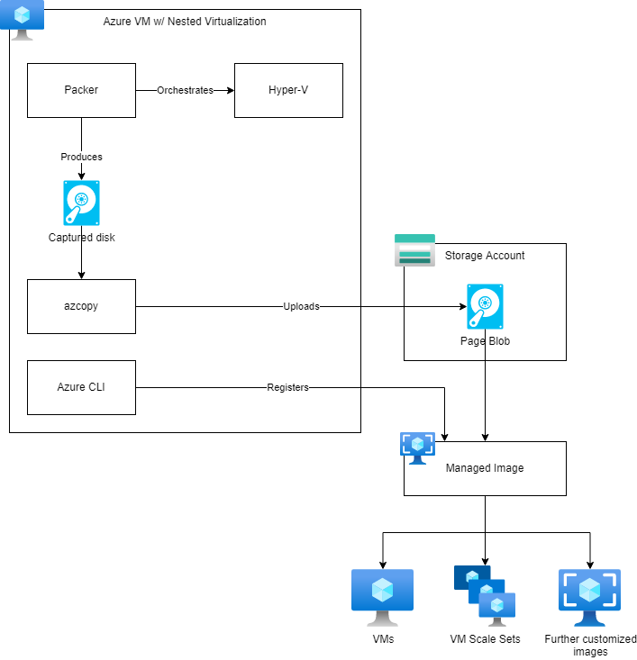

# nested-virtualization-image-builder

Virtual machine images are typically customized from base images already present in the Azure Marketplace or an organization's [Azure Compute Gallery](https://docs.microsoft.com/en-us/azure/virtual-machines/shared-image-galleries). Other times, you may need to build and upload images from scratch. This repository shows how to combine [nested virtualization](https://docs.microsoft.com/en-us/virtualization/hyper-v-on-windows/user-guide/nested-virtualization) with [Packer](https://www.packer.io/) to bootstrap these images in a repeatable and cost-effective manner.



## Prerequisites

* An Azure subscription where you hold the `Owner` role
* [Azure CLI](https://docs.microsoft.com/en-us/cli/azure/install-azure-cli)

## Usage

The first step is to deploy the builder VM and the supporting resources needed to capture images. It will take about 10 minutes to provision resources and configure the builder.

```shell
# Login to Azure
az login

# Choose an Azure region for your builder
LOCATION=westus3

# Deploy the builder VM and supporting resources
az deployment sub create -l $LOCATION -f ./builder/bicep/main.bicep -p "location=${LOCATION}"
```

Navigate to the VM in the Azure Portal. In the top bar, click `Connect -> RDP`, download the RDP file, then connect to the builder VM. Your credentials are:

* Username: `azureuser`
* Password: `<the password you entered during deployment>`

The builder VM is already configured with the tools needed to build images. Inside the builder VM, open PowerShell as Administrator and run the following commands to build an image from one of the samples provided in the repo.

```powershell
# Clone the repo
# core.autocrlf=input will ensure that LF doesn't get converted to CRLF, which breaks scripts when building Linux images
git clone https://github.com/Azure-Samples/nested-virtualization-image-builder --config core.autocrlf=input

# Build a sample Ubuntu 20.04 image
cd .\nested-virtualization-image-builder\images\ubuntu2004\
packer build .\ubuntu2004.pkr.hcl
```

After your image is built, you will have a `.vhd` file that contains a generalized OS image. The next step is to upload it as a Page Blob to an Azure Storage Account, then register it as a Managed Image in your subscription. In PowerShell on the builder:

```powershell
# Use Managed Identity for azcopy
azcopy login --identity

# Use Managed Identity for azure-cli
az login --identity

# Upload the VHD to blob storage
$storageAccount = az deployment group show -g builder -n storage --query 'properties.outputs.storageAccount.value' -o tsv
azcopy copy '.\output-ubuntu2004\Virtual Hard Disks\packer-ubuntu2004.vhd' "https://$storageAccount.blob.core.windows.net/images/ubuntu2004.vhd"

# Register the image
az image create -g builder -n ubuntu2004 --os-type Linux --source "https://$storageAccount.blob.core.windows.net/images/ubuntu2004.vhd"
```

## Cleanup

To clean up all Azure resources deployed by this sample, you can delete the parent Resource Group

```shell
az group delete -n builder
```

## Resources

* [Nested Virtualization in Azure](https://azure.microsoft.com/en-us/blog/nested-virtualization-in-azure/)
* [Nested Virtualization](https://docs.microsoft.com/en-us/virtualization/hyper-v-on-windows/user-guide/nested-virtualization)
* [Sizes for virtual machines in Azure](https://docs.microsoft.com/en-us/azure/virtual-machines/sizes)
* Packer: [Hyper-V Builder (from an ISO)](https://www.packer.io/plugins/builders/hyperv/iso)

## VM sizes that support nested virtualization

Most general purpose, compute-optimized, and memory-optimized VM sizes from `Dv3`/`Dsv3` and newer have nested virtualization enabled. The docs for each VM size will have the details. 

For example, [Dv3 and Dsv3-series](https://docs.microsoft.com/en-us/azure/virtual-machines/dv3-dsv3-series) reads "Nested Virtualization: Supported".
